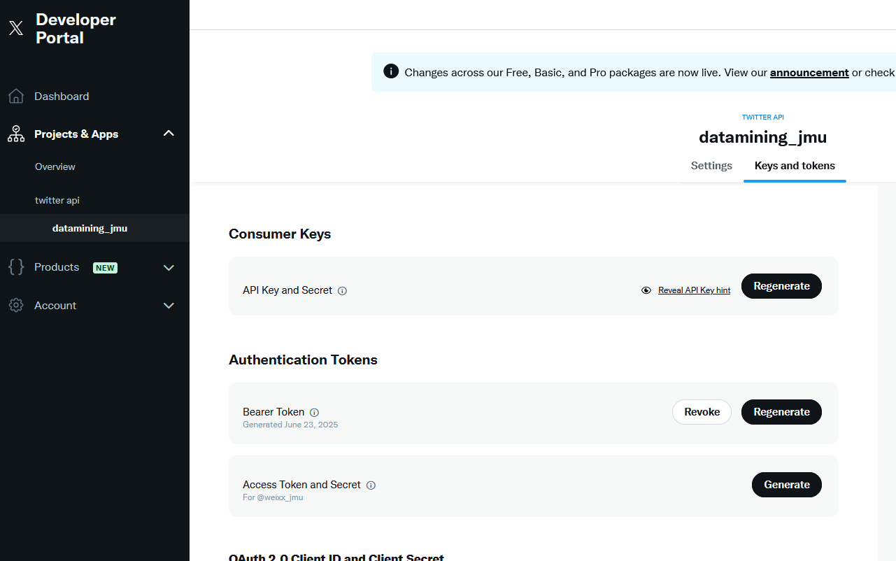
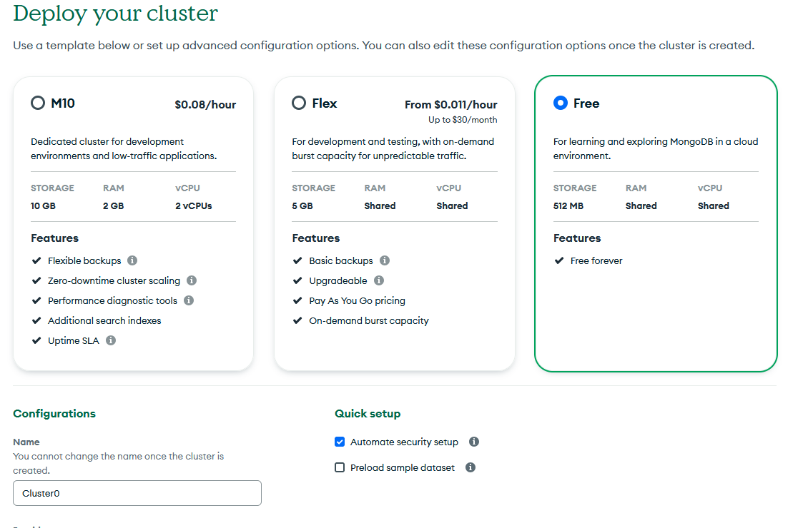
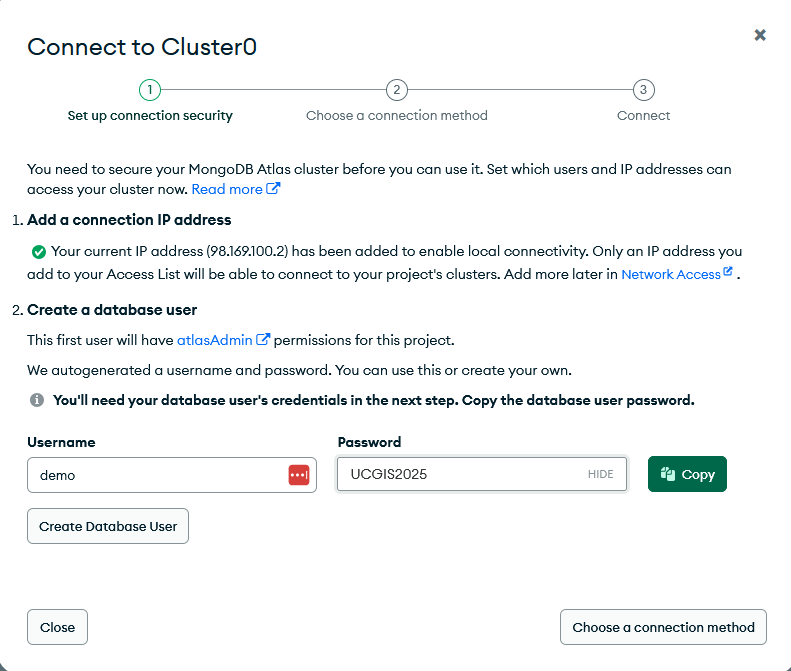
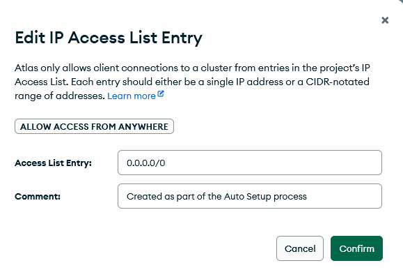
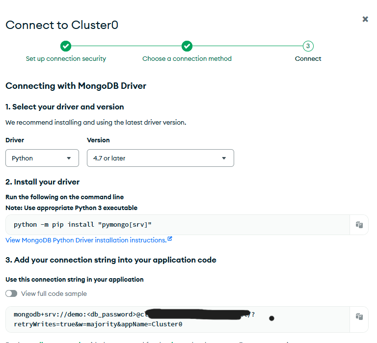
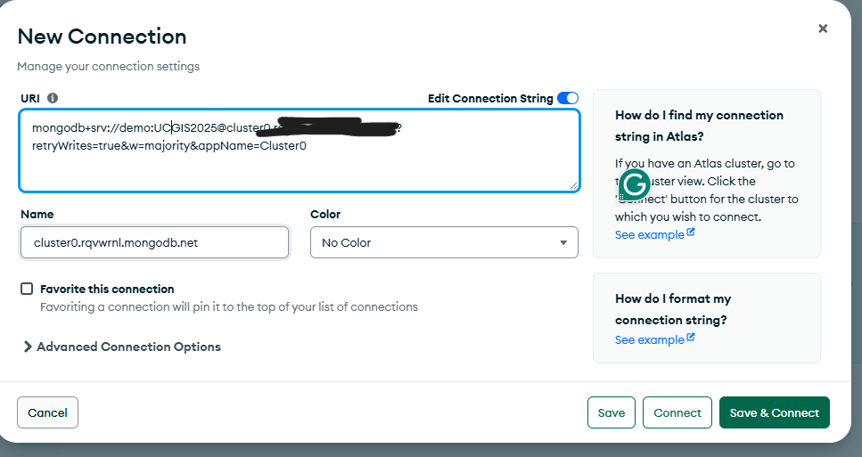
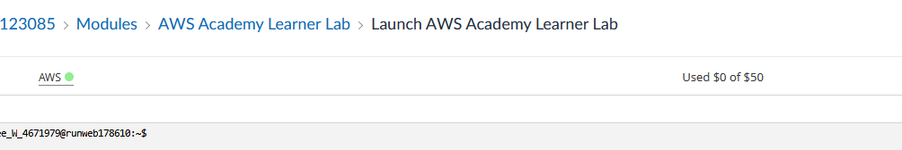

# UCGIS 2025 Workshop

## Advancing Social Media Analytics with AI

**Instructor:** Xuebin Wei  
**Associate Professor, School of Integrated Science, James Madison University**  
📧 [weixx@jmu.edu](mailto:weixx@jmu.edu)  
🌐 [www.lbsocial.net](https://www.lbsocial.net)  
📘 **Textbook:** [Social Data Analytics in the Cloud with AI](https://www.taylorfrancis.com/books/mono/10.1201/9781003437611/social-data-analytics-cloud-ai-xuebin-wei-xinyue-ye)  
💻 **Demo Code:** [GitHub Repository](https://github.com/xbwei/data-analysis-with-generative-ai)

---

## Introduction

This hands-on workshop explores AI-powered social media analytics, focusing on Twitter (X) data collection, analysis, and visualization. Participants will learn to use MongoDB for scalable storage, generative AI for text and image processing, and retrieval-augmented generation (RAG) for enhanced data insights. These techniques are critical for researchers and professionals working in fields such as public sentiment analysis, misinformation detection, disaster response, and urban studies.

---

## Set Up Cloud Resources

### Twitter Free API

Twitter recently updated its policy to allow the free API to collect 100 tweets per month.

- Register for a Twitter account at [https://x.com](https://x.com) if you don’t already have one.
- Apply for a free Twitter Developer account at [https://developer.x.com/en]. A short [video demo](https://www.youtube.com/shorts/GBmR_bnqrOs) is available.
- Log in to your developer account. Under **Projects & Apps**, find your default app. Click **Keys and Tokens**, and generate a **Bearer Token**.
- Copy the Bearer Token and save it locally (e.g., in a text file).

> If you can’t create a Twitter API, use the provided demo Tweet data.

---

### MongoDB Cluster

MongoDB is a popular NoSQL database that offers a free M0 cluster in its Atlas service.

- Accept the invitation and register your account at [https://www.mongodb.com](https://www.mongodb.com).
- Log in and create a new project (name it after yourself).
- In your project, create a free cluster.

Next, create a database user. To simplify the workshop, we’ll use the same credentials:

- Username: `demo`
- Password: `UCGIS2025`

While the cluster is being created, go to **Security > Network Access**, click **Edit**, and allow access from anywhere.

- Open **Clusters > Connect > Drivers > Python**, copy the connection string, and save it locally.

- Download and install [MongoDB Compass](https://www.mongodb.com/try/download/compass).
- Open Compass, paste the connection string, and update the password to `UCGIS2025`.

You should now see your cluster on the left side.

---

### AWS Academy Lab

AWS Academy offers free credits for students to utilize AWS services, including coding, machine learning, storage, and more.

- Accept your invitation to AWS Academy Learner Lab and create a password.
- Log in at [https://awsacademy.instructure.com/login/canvas].
- Open **Modules > Launch AWS Academy Learner Lab**.
- Accept terms and click **Start Lab**. When the AWS dot turns green, click the AWS link to open the console.

#### Store Secrets in AWS Secrets Manager

- Open **Secrets Manager** and click **Store a new secret**.
- Choose **Other type of secret** and enter the following credentials:

**Twitter API**  
- Key: `bearer_token`  
- Value: your bearer token  
- Secret name: `twitter_api`

**MongoDB**  
- Key: `connection_string`  
- Value: your connection string (with password `UCGIS2025`)  
- Secret name: `mongodb`

**OpenAI API**  
- Key: `api_key`  
- Value: your OpenAI API key (from email)  
- Secret name: `openai`

- Accept the default settings and store the secrets.

---

### SageMaker Jupyter Notebook

- In AWS Console, search for **Amazon SageMaker**, click **Notebooks**, and then **Create a notebook instance**.
- Provide an instance name.
- Under **Git repositories**, clone the public Git repository:  
  `https://github.com/xbwei/data-analysis-with-generative-ai.git`
- Leave default settings and create the instance (ready in 1–2 minutes).
- Click **Open Jupyter** when the instance is in service.

---

## Collect Twitter Data

- Open **Collect_Twitter_Data** in JupyterLab.
- Run each cell from top to bottom.
- You can change the keyword in the data collection cell (default: “generative AI”).

After data is collected, refresh MongoDB Compass to view the tweets.

> Optional: If you can’t collect tweets:
> - Create a database `demo` and collection `tweet_collection` in Compass.
> - Click **Import Data** and upload the demo tweets file from your email.

---

## Analyze Tweet Text with OpenAI

- Open **Analyze_Twitter_Data**.
- Execute all cells.

This notebook uses the OpenAI API to perform:
- Sentiment analysis
- Language translation
- Emotion detection
- Entity extraction
- Summarization

---

## Analyze Tweet Images with OpenAI

- Open **Twitter-Image-Classification-Recreation-Editing**.
- Select the `conda_pytorch` kernel and run all cells.

This notebook:
- Extracts tweets containing images
- Analyzes images and generates descriptions
- Recreates new images based on prompts
- Uses PyTorch to create a segmentation mask

> Re-run the image cell to view a different image.
> Edit the prompt in the last cell to experiment with generated images.

---

## Vector Database and RAG System

- Open **Exploring-Twitter-Data-with-Vector-Databases-and-RAG-Systems**.
- Run all cells.

This notebook:
- Creates a vector database on MongoDB
- Embeds tweet text
- Implements a chatbot using Retrieval-Augmented Generation (RAG)

You can now ask the chatbot questions such as:
- “What’s the latest AI news in my tweets?”
- “Summarize what people are saying about studying AI.”

---

## Query Twitter Data in Compass

- Open Compass and click **Generate Query**.
- Log in with your Atlas account.
- Ask questions in natural language, such as:
  - “Which tweets have the most likes?”
  - “How many tweets are positive?”
  - “Top 10 popular Twitter users”
  - “Top 10 extracted organizations”

> MongoDB will convert your questions into document queries or aggregation pipelines. Always verify results.

---

## Visualize Twitter Data with MongoDB Charts

- Open **MongoDB Atlas > Charts**.
- Wait for initialization. Once ready, open your dashboard.

### Manually Create Charts

- Select `tweet_collection` from the `demo` database.
- Drag fields into the chart editor.
- Example: Number chart of tweet IDs, stacked bar chart for sentiment and emotion.

### Create Charts with Natural Language

- Add a new chart and switch to **Natural Language Chart**.
- Ask: “Top 10 most popular Twitter users,” “Most common hashtags,” or “Top 10 extracted persons.”

> Natural language charts may be inaccurate—verify outputs.

### Enable Filters

- Add filters to make the dashboard interactive (e.g., sentiment).
- Clicking a filter (like “Negative”) updates all other charts accordingly.

---

## End of the Workshop

### AWS Learner Lab

- Try other notebooks.
- When finished, close JupyterLab and stop the instance.
- End your AWS Learner Lab.

⏳ Your AWS Academy Lab is available until **10/31/2025**.

### MongoDB

- Your cluster is free forever.
- Instructor access is possible—create a new project if needed.

### Twitter API

- You control your API. Free tier: 100 tweets/month.

### OpenAI API

- The workshop API key will be revoked after the session.
- Purchase your own key to continue using OpenAI.

---

Thank you for participating in the UCGIS 2025 Workshop on **Advancing Social Media Analytics with AI**!
