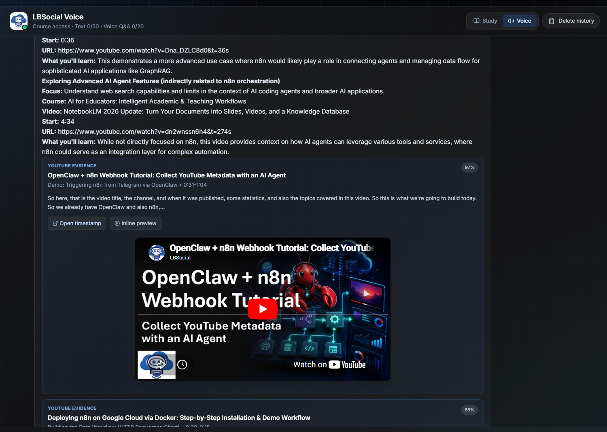
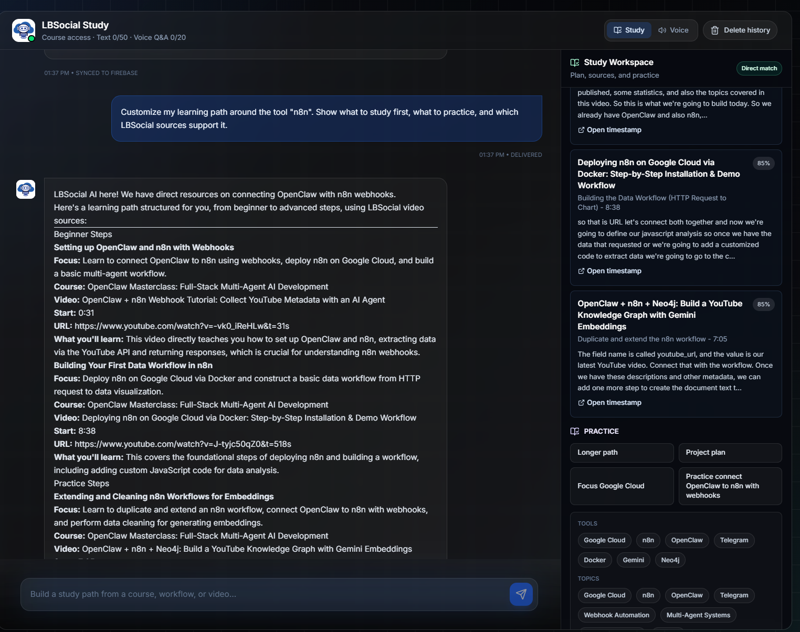
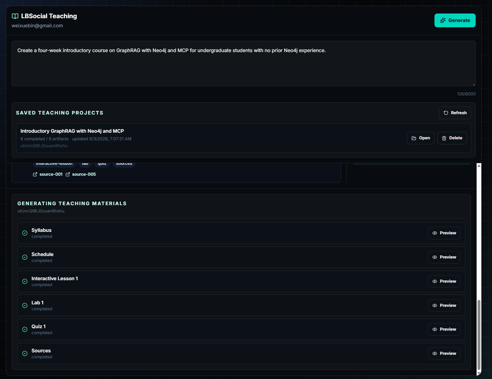
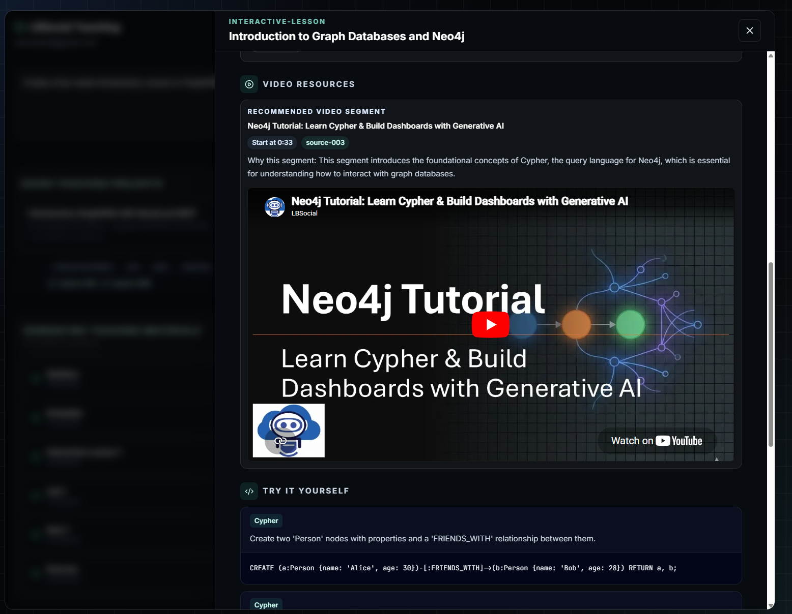
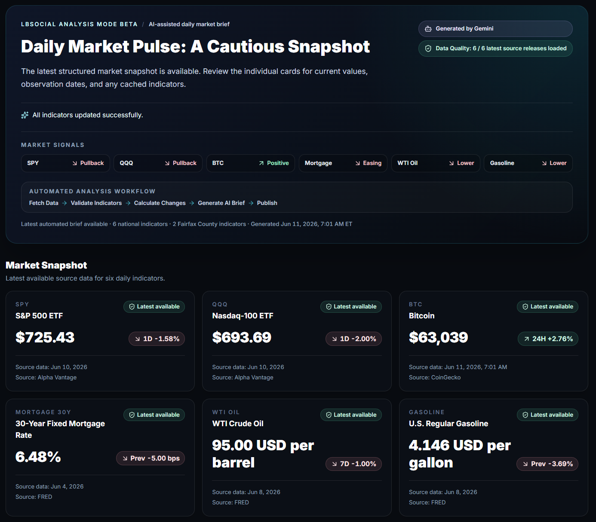
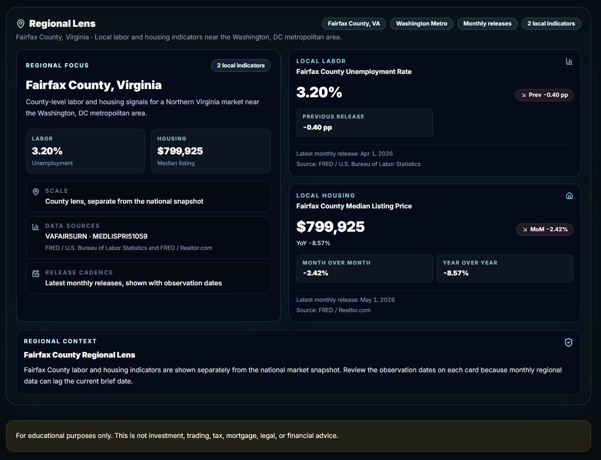

  

    
UCGIS 2026 Presentation

    <h1 class="deck-title">Humans, AI Agents, and Teaching Stacks in GeoAI Education</h1>
    
AI is becoming a stronger tool. Humans still give it purpose.

  

  

    
Xuebin Wei

    
James Madison University

    
<a href="mailto:weixx@jmu.edu">weixx@jmu.edu</a>

    
<a href="https://www.lbsocial.net">lbsocial.net</a>

  

Note:
My idea is simple. AI is changing very fast. It is becoming a stronger tool for teaching and research. But I do not think AI replaces the human role. Humans still define the goal, the value, and the reason why we use these tools.

---

## AI: Three Stages

  

    1
    <h3>Prompt engineering</h3>
    
Human and model talk directly.

  

  
-&gt;

  

    2
    <h3>Context engineering</h3>
    
The model receives trusted materials.

  

  
-&gt;

  

    3
    <h3>Harness engineering</h3>
    
Agents use tools, skills, and MCP services.

  

Note:
I see the recent development of AI in three broad stages. First, prompt engineering: we learned how to ask better. Second, context engineering: we learned how to give AI the right materials. Third, harness engineering: we give AI tools, skills, MCP services, and workflow structure. This is not a complete history of AI, but it is a useful way to explain how my teaching and research practice has changed.

---

## How This Deck Was Built

  

    

      <h3>My teaching corpus</h3>
      
Tutorials, YouTube videos, transcripts, notebooks, and related course materials are indexed in a graph database.

    

    

      videos
      transcripts
      notebooks
      graph database
    

  

  

  

    

      <h3>AI agent + MCP</h3>
      
Codex uses an MCP server to query that graph and retrieve relevant examples for this talk.

    

    

      Codex
      MCP server
      graph query
    

  

  

  

    

      <h3>Slide evidence</h3>
      
The retrieved materials help select demo clips and connect them to the prompt, context, and harness story.

    

    

      matched clips
      examples
      slide narrative
    

  

The deck is also a small example of harness engineering: an agent using tools and my own knowledge base to support presentation design.

Note:
I also want to explain how this deck was built. I have a graph database that stores my tutorials, videos, transcripts, notebooks, and related teaching materials. Instead of searching manually through everything, I used an AI agent, Codex, connected through an MCP server, to query that knowledge graph. It helped retrieve relevant previous teaching examples and video clips. So the deck itself is a small example of the workflow I am describing.

---

## From Prompt Engineering

  

    
Stage 1

    <ul>
      <li>At the beginning, we learned to control LLMs with better prompts.</li>
      <li>We used examples, formats, and clear instructions.</li>
      <li>The model mostly worked inside the conversation.</li>
    </ul>
    

      
Human

      

        instruction
        example
        format
      

      
LLM

    

  

  

    <iframe src="https://www.youtube.com/embed/fdg0Zo7Wj5M?start=745" title="Prompt engineering tutorial" allowfullscreen></iframe>
    
<a href="https://www.youtube.com/watch?v=fdg0Zo7Wj5M&t=745s">Prompt engineering example</a>

  

Note:
The first stage I taught was prompt engineering. We learned that if we give examples and clear output formats, the model can follow patterns. This was a very important step. But it was still mostly about asking the model in a better way.

---

## To Reasoning Models

  

    
A stronger model core

    <ul>
      <li>Models became better at multi-step thinking.</li>
      <li>They can compare different paths before giving an answer.</li>
      <li>This makes them more useful for data analysis and research tasks.</li>
    </ul>
    

      
question

      

        path A
        path B
        path C
      

      
answer

    

  

  

    <iframe src="https://www.youtube.com/embed/DAyfcycvM4E?start=37" title="Reasoning model tutorial" allowfullscreen></iframe>
    
<a href="https://www.youtube.com/watch?v=DAyfcycvM4E&t=37s">Reasoning model example</a>

  

Note:
The next stage is reasoning models. In my tutorial, I explained that reasoning models may take multiple steps before they answer. They can compare possible solutions. They are not perfect, but they are stronger for harder tasks. This changed how I think about AI for research and teaching.

---

## To Context Engineering

  

    
Stage 2

    <ul>
      <li>Prompting is not enough when the task needs trusted knowledge.</li>
      <li>Context engineering gives AI the right documents, data, memory, and evidence.</li>
      <li>RAG, embeddings, and knowledge graphs help AI use the right material.</li>
    </ul>
    

      

        docs
        data
        memory
        graph
      

      
retrieve

      
grounded LLM

    

  

  

    <iframe src="https://www.youtube.com/embed/nmdQcFbVXug?start=41" title="RAG and embeddings tutorial" allowfullscreen></iframe>
    
<a href="https://www.youtube.com/watch?v=nmdQcFbVXug&t=41s">RAG and embeddings example</a>

  

Note:
After prompt engineering, I think the next important idea is context engineering. We cannot put everything in one prompt. We need to select the right information. That is why RAG, embeddings, vector search, and knowledge graphs are useful. They help AI find trusted materials before it answers.

---

## GeoAI Needs Grounding

  

    
Geographic context

    <ul>
      <li>In GeoAI, evidence is not only text.</li>
      <li>We also need places, relations, scale, and spatial context.</li>
      <li>GraphRAG can connect language, graph structure, and geographic evidence.</li>
    </ul>
    

      place
      relation
      scale
      evidence
    

  

  

    <iframe src="https://www.youtube.com/embed/JX5BOb-nQrY?start=708" title="Geo GraphRAG tutorial" allowfullscreen></iframe>
    
<a href="https://www.youtube.com/watch?v=JX5BOb-nQrY&t=708s">Geo GraphRAG example</a>

  

Note:
For GIScience and GeoAI, context is even more important. Spatial questions include location, distance, scale, and relationships. In my Geo GraphRAG tutorial, I combined spatial filtering, vector search, graph retrieval, and a language model. This is a good example of AI using more than text.

---

## To Harness Engineering

  

    
Stage 3

    <ul>
      <li>Now we are moving toward agents with tools.</li>
      <li>Agents can use MCP services, data, skills, and cloud systems.</li>
      <li>The key question becomes: what should we let the agent do?</li>
    </ul>
    

      
AI agent

      MCP
      tools
      skills
      workflow
    

  

  

    

      <iframe src="https://www.youtube.com/embed/Dna_DZLC8d0?start=70" title="MCP and KG agent tutorial" allowfullscreen></iframe>
      
<a href="https://www.youtube.com/watch?v=Dna_DZLC8d0&t=70s">MCP + KG agent</a>

    

    

      <iframe src="https://www.youtube.com/embed/_ssB1YXRRtk?start=935" title="Classroom agent workflow tutorial" allowfullscreen></iframe>
      
<a href="https://www.youtube.com/watch?v=_ssB1YXRRtk&t=935s">Classroom workflow agent</a>

    

  

Note:
I call the current stage harness engineering. The model itself is important, but the harness around it is also important. The agent needs tools, skills, MCP services, databases, and cloud execution. If we build the harness well, the agent can do much more than answer questions. It can use tools and finish workflows. But this also means we need to decide what actions are safe and what actions need human approval.

---

## Demo: Course Assistant

  

    
Example workflow

    <ul>
      <li>A course assistant can answer from trusted teaching materials instead of generic web text.</li>
      <li>The goal is guided support: students still need to read, compare, and explain.</li>
      <li>This is one example of context engineering in an educational setting.</li>
    </ul>
  

  

    <iframe src="https://www.youtube.com/embed/p0N20TW0dN0?start=0" title="AI teaching assistant tutorial" allowfullscreen></iframe>
    
<a href="https://www.youtube.com/watch?v=p0N20TW0dN0&t=0s">Course assistant demo</a>

  

Note:
This first demo is about student support. The point is not to let AI replace reading or explanation. The point is to connect the assistant to course materials so students receive more grounded support while still doing the intellectual work.

---

## Demo: Teaching Preparation

  

    
Example workflow

    <ul>
      <li>AI can reduce repetitive preparation work for instructors.</li>
      <li>It can draft outlines, slides, scripts, short videos, and classroom materials.</li>
      <li>The instructor still reviews, revises, and decides what is appropriate.</li>
    </ul>
  

  

    <iframe src="https://www.youtube.com/embed/RDKVcaE52hg?start=31" title="AI teaching video workflow" allowfullscreen></iframe>
    
<a href="https://www.youtube.com/watch?v=RDKVcaE52hg&t=31s">Teaching preparation demo</a>

  

Note:
This second demo is about teaching preparation. AI can make the preparation process faster, especially when the instructor already knows what they want to teach. The human role is still central: the instructor sets the purpose and checks the quality.

---

## Demo: Data Analysis Workflow

  

    
Example workflow

    <ul>
      <li>AI can assist with data cleaning, dashboard exploration, and interpretation tasks.</li>
      <li>For GIScience, the workflow still needs evidence, spatial context, and domain judgment.</li>
      <li>The value is not automatic insight; it is a more efficient analytical workflow.</li>
    </ul>
  

  

    <iframe src="https://www.youtube.com/embed/AJLRsjjWWKo?start=42" title="AI analysis dashboard tutorial" allowfullscreen></iframe>
    
<a href="https://www.youtube.com/watch?v=AJLRsjjWWKo&t=42s">Analysis workflow demo</a>

  

Note:
This third demo connects AI to data analysis. AI can help move through routine steps and make analysis more accessible. But especially in GeoAI, the analyst still needs to understand evidence, uncertainty, spatial scale, and the limits of the workflow.

---

## What AI Still Does Not Have

  

    <ul>
      <li>AI can extend human capacity, but it does not have human life.</li>
      <li>AI can produce fluent interaction, but it does not naturally care.</li>
      <li>Humans care about communities, fairness, places, and the future.</li>
      <li>That is why human judgment must stay in the loop.</li>
    </ul>
  

  

    

      <h3>AI</h3>
      
speed

      
scale

      
memory

    

    
supports

    

      <h3>Human</h3>
      
purpose

      
care

      
judgment

    

  

Note:
This is the most important part for me. AI may become very powerful, but it is still different from humans. Humans have life. Humans have emotion. Humans have self-awareness. We care about the future, our communities, and the places where people live. AI does not naturally care about that. AI can support our work, but it should not replace the human role in deciding purpose and value.

---

## Current Experiment: Three Modes

  

    <h3>Study Mode</h3>
    
Grounded support for students working through course materials.

  

  

    <h3>Teaching Mode</h3>
    
Instructor-facing support for preparing and revising teaching assets.

  

  

    <h3>Analysis Mode</h3>
    
Research-facing support for data, dashboards, and GeoAI workflows.

  

Current experiment: AI support for learning, teaching, and analysis workflows.

Note:
After the demos and the human-centered question, this is the practical structure I am building. The current experiment has three modes: Study Mode, Teaching Mode, and Analysis Mode. The emphasis is not that AI replaces these activities; the emphasis is that AI can support different kinds of educational and research work when the workflow is designed carefully.

---

## Study Mode

  <figure class="screenshot-card zoomable">
    
    <figcaption>Course-grounded learning support</figcaption>
  </figure>
  <figure class="screenshot-card zoomable">
    
    <figcaption>Student questions connected to trusted materials</figcaption>
  </figure>

Note:
Study Mode is for students. It should help them work with trusted course material, not bypass the learning process. The design goal is grounded support that encourages students to read, ask better questions, and explain their reasoning.

---

## Teaching Mode

  <figure class="screenshot-card zoomable">
    
    <figcaption>Instructor workflow support</figcaption>
  </figure>
  <figure class="screenshot-card zoomable">
    
    <figcaption>Drafting materials with human review</figcaption>
  </figure>

Note:
Teaching Mode is for instructors. It can support the preparation of lessons, labs, quizzes, and media, but the instructor remains responsible for the final teaching decision. This is where efficiency and professional judgment need to work together.

---

## Analysis Mode

  <figure class="screenshot-card zoomable">
    
    <figcaption>Research and data workflow support</figcaption>
  </figure>
  <figure class="screenshot-card zoomable">
    
    <figcaption>Dashboards, evidence, and GeoAI analysis</figcaption>
  </figure>

Note:
Analysis Mode connects the same stack to research and analysis. It can support data exploration, dashboards, and GeoAI workflows. The analyst still needs to decide what question matters, what evidence is credible, and how to interpret the result.

---

## What This Means for GIScience and GeoAI

  <ol class="final-points">
    <li><strong>Extend human capacity.</strong> Use AI to reduce repetitive work and make complex teaching and research workflows more feasible.</li>
    <li><strong>Build brain muscle.</strong> Students still need critical thinking, question framing, evidence evaluation, and disciplinary judgment.</li>
    <li><strong>Decide what matters.</strong> AI can expand what we can do; humans must decide the purpose, standards, and consequences.</li>
  </ol>
  

    
Xuebin Wei

    
James Madison University

    
<a href="mailto:weixx@jmu.edu">weixx@jmu.edu</a>

    
<a href="https://www.lbsocial.net">lbsocial.net</a>

  

Note:
My final suggestion is practical. Use AI to extend human capacity and reduce repetitive work. But this does not mean students should think less. They need to build critical thinking, question framing, evidence evaluation, and disciplinary judgment. AI can expand what we can do, but humans must decide what matters.
