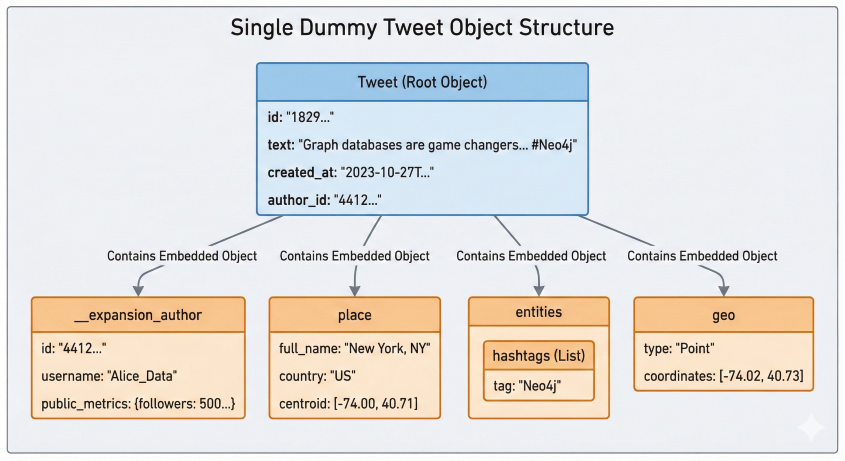
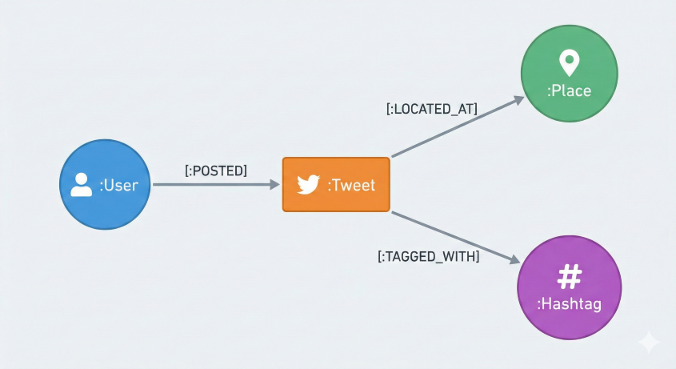
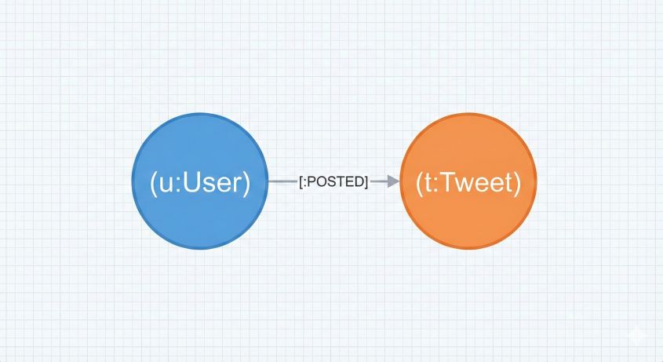
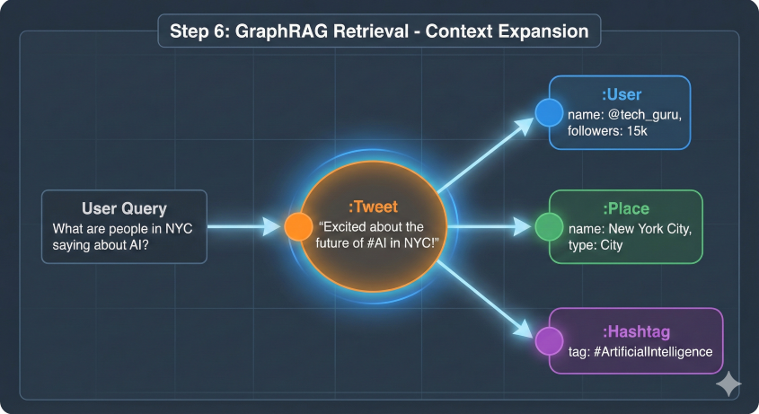
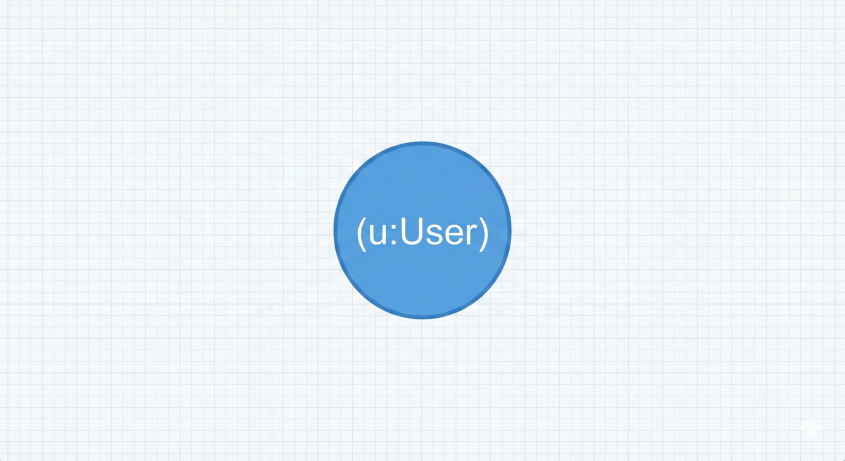
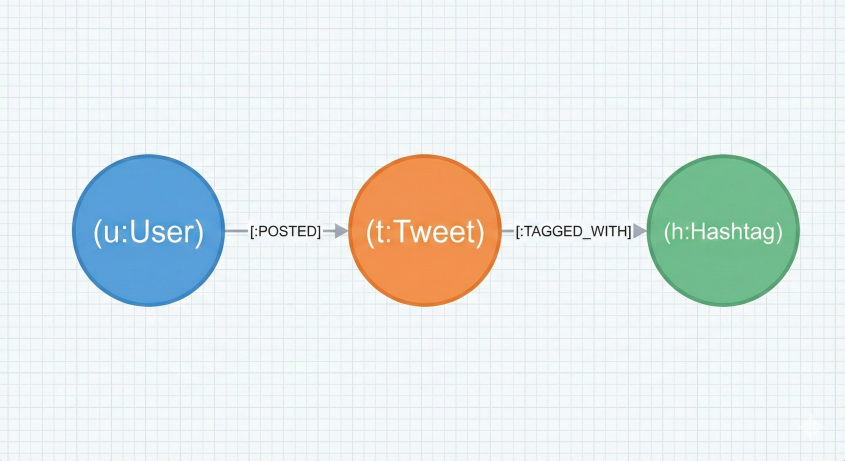
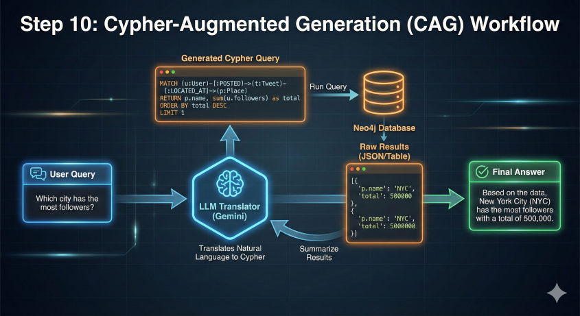
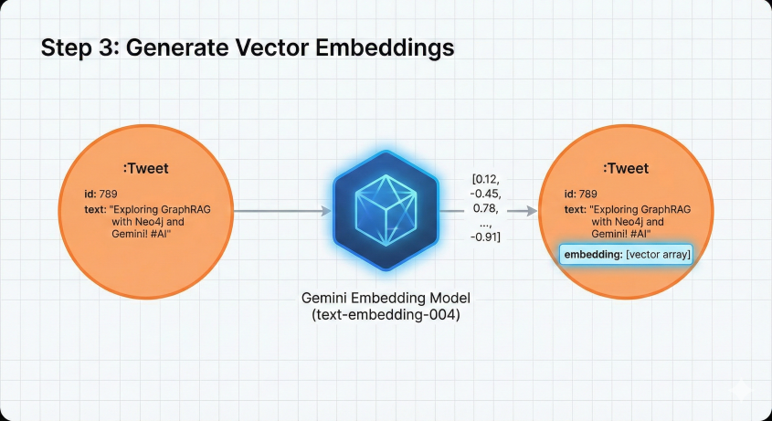
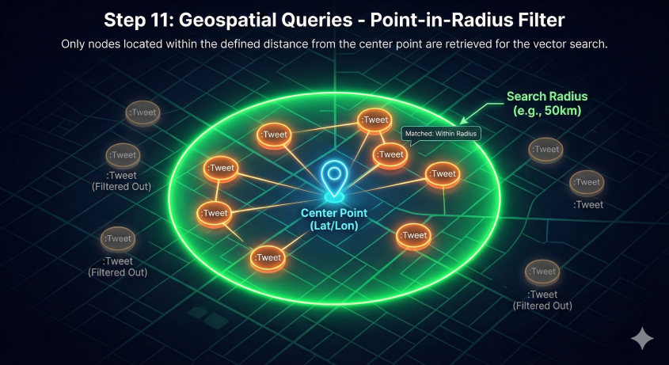

# UCGIS 2026 Workshop: The Ultimate Step-by-Step Guide

## Advancing Social Media Analytics in Neo4j: Multimodal Embeddings and AI Agents with Knowledge Graphs

**Workshop Description**: [View on Sched](https://ucgissymposium2026.sched.com/event/2KN6D/advancing-social-media-analytics-in-neo4j-multimodal-embeddings-and-ai-agents-with-knowledge-graphs)

This workshop focuses on the intersection of Generative AI, Knowledge Graphs, and Social Media Analytics. We will build an entirely free, AI-powered pipeline from data collection to a deployed Neo4j AI Agent.

*(Note: Everything in this workshop uses free tiers! No credit cards required.)*

---

## Part 1: Building the Knowledge Graph

Stop staring at flat rows of data! In this first part, we build a high-performance ETL pipeline to transform nested JSON social media posts into a living, connected network using Python and Neo4j.

### Step 0: Setting Up Your Neo4j AuraDB Instance

**Why are we doing this?**
Traditional relational databases (like MySQL or Postgres) are designed for tabular data. When dealing with highly interconnected social media data—where users follow users, post tweets, use hashtags, and check in at locations—joining these tables becomes incredibly slow and counterintuitive. Graph databases treat relationships as first-class citizens, allowing for blazing-fast traversals.

**How to do it:**
1. **Create an Account**: Sign up at Neo4j Aura.
2. **Launch Instance**: Click "Create Instance" and select **AuraDB Free**. This supports up to 200,000 nodes—plenty for our tutorial. *(⚠️ Reject the default instance! The default is a free trial that will eventually cost money).*
3. **Save Your Credentials**: *Crucial Step!* Download the generated `.txt` file. This single document contains your Connection URI, Username, and Password. You will need all three to link your Python code to the database.
4. **Verify**: Ensure the Neo4j Aura Console shows your instance is **RUNNING**.

### Step 1: The Architecture of a Tweet

**Why are we doing this?**
Before writing any code to import data, we must understand the shape of our data. A raw tweet from an API comes as a deeply nested JSON document. If we insert this raw document directly, it's hard to query relationships (e.g., "Find all users who tweeted from New York"). We need to map this JSON into a Graph Schema.

**How it works:**
We decompose the JSON into distinct entities. 


*Figure 1: The nested JSON structure of a single dummy tweet object showing embedded author and place data.*

By extracting the embedded objects, we map them to four distinct node types: `User`, `Tweet`, `Place`, and `Hashtag`. Then, we define the relationships that connect them.


*Figure 2: Mapping relationships between User, Tweet, Place, and Hashtag nodes. This schema mirrors real-world social interactions.*

### Step 2: Generating Context-Aware Social Data

**Why are we doing this?**
To properly test a GraphRAG system, we need data that is semantically rich. Randomly generated strings won't work well for AI embeddings. We need "Semantic Clusters" of topics (like AI, Python, or Cloud) so the AI has meaningful context to retrieve later.

**How to do it:**
We use the Python `Faker` library combined with a predefined dictionary of topics to synthetically generate realistic tweets. 

```python
# Install dependencies
!pip install neo4j faker -q

# Sample of the generation strategy
from faker import Faker
fake = Faker()

topic_content = {
    "Neo4j": ["Graph databases are game changers for complex relationships.", "Just learned Cypher!"],
    "AI": ["Generative AI is transforming how we write code every day.", "LLMs are evolving."]
}
# We iterate through these topics to generate thousands of connected JSON tweet objects.
```

### Step 3: High-Performance Ingestion

**Why are we doing this?**
When inserting thousands of tweets, executing an `INSERT` statement one by one over a network connection is incredibly slow. We need a high-performance method to batch-process the data. 

**How it works:**
We use the Cypher `UNWIND` command. `UNWIND` takes a large JSON list from Python, "unrolls" it in the database memory, and processes the entire batch in a single transaction.

```python
import json
from neo4j import GraphDatabase

# Using Cypher UNWIND to map JSON to Nodes/Relationships efficiently
query = """
UNWIND $batch AS row
MERGE (u:User {id: row.__expansion_author.id})
SET u.username = row.__expansion_author.username

CREATE (t:Tweet {id: row.id})
SET t.text = row.text, t.created_at = datetime(row.created_at)

MERGE (u)-[:POSTED]->(t)
"""
# Notice the use of MERGE. MERGE acts like an "Upsert" (Insert or Update). 
# It ensures we don't create duplicate User nodes if a user posts multiple tweets.
```


*Figure 3: The result of our ingestion: Multiple tweets effectively connected to their respective User nodes.*

### Step 4: Exploring Your Data

**Why are we doing this?**
Before moving to complex analytics, it is critical to visually verify that our ingestion script worked and the relationships formed correctly.

**How to do it:**
Head to the **Explore** tool in the Neo4j console.
Double-click a User node to "expand" their network. This visual exploration allows you to verify that the connections (`POSTED`, `TAGGED_WITH`) exist as expected.


*Figure 4: Expanding a node in Neo4j Workspace to visually navigate connected data.*

---

## Part 2: Mastering Cypher & Dashboards

### Step 5: Learning the Basics of Cypher

**Why are we doing this?**
To ask our database questions, we need to speak its language. Cypher is the query language for graph databases, optimized specifically for matching patterns.

**How it works:**
Cypher uses ASCII-art style syntax to literally "draw" the data pattern you are looking for.

**Defining Nodes:**
Nodes are wrapped in parentheses `()` to look like circles.
`(u:User)` 


*Figure 5: The visual representation of the `(u:User)` pattern.*

**Defining Relationships:**
Relationships use square brackets `[]` and arrows `->` to show direction. 
`(u:User)-[:POSTED]->(t:Tweet)`

**Chaining the Graph:**
You can chain these together to traverse the graph deeply.
`(u:User)-[:POSTED]->(t:Tweet)-[:TAGGED_WITH]->(h:Hashtag)`


*Figure 6: A complex pattern traversing Users, Tweets, Places, and Hashtags.*

### Step 6: Using Generative AI to Write Queries

**Why are we doing this?**
Writing complex Cypher logic (with multiple `WHERE` and `WITH` clauses) can be daunting for beginners. We can leverage an LLM to translate plain English into optimized Cypher code.

**How to do it:**
Neo4j includes built-in AI tools. In the query window, simply type:
*"Find the users who posted tweets containing the hashtag 'AI'."*


*Figure 7: The AI reads the database schema and automatically translates the natural language request into executable Cypher code.*

### Step 7: Building an Interactive Dashboard

**Why are we doing this?**
A static query result is only useful for a developer. To share insights with stakeholders, we need interactive, visual dashboards.

**How to do it:**
1. **Generate**: Ask the AI: *"I want to explore the locations of tweets, popular hashtags, and date."*
2. **Parameterize**: Add a dropdown Place Filter. Modify the Cypher logic to listen to the filter parameter:
   `WHERE (p.name = $place_name OR $place_name IS NULL)`
This dynamic logic ensures that if you select a specific city, the charts filter down. If you clear it, it returns to a global view.

---

## Part 3: Generating Embeddings & Geo GraphRAG

### Step 8: Securing Your Free Gemini API Key

**Why are we doing this?**
To build a Retrieval-Augmented Generation (RAG) system, we need access to a Large Language Model (LLM) and an Embedding model. Google's Gemini provides a powerful, free tier ideal for this workshop.

**How to do it:**
1. Sign in to Google AI Studio and generate a free API key.
2. Initialize connections:

```python
pip install neo4j google-genai python-dotenv -q

from neo4j import GraphDatabase
from google import genai

client = genai.Client(api_key="YOUR_GEMINI_API_KEY")
driver = GraphDatabase.driver("neo4j+s://your-uri", auth=("neo4j", "your-password"))
driver.verify_connectivity()
```

### Step 9: Generating 3072-Dimensional Vector Embeddings

**Why are we doing this?**
Computers cannot understand the "meaning" of words. By converting text into a long string of numbers (a vector embedding), the database can perform mathematical operations to find sentences with similar meanings, even if they don't share the exact same keywords (e.g., matching "puppy" to "dog").

**How it works:**
We use `gemini-embedding-001` to embed the text.


*Figure 8: Converting tweet text into a vector array and storing it as a property on the Tweet node.*

```python
def get_embeddings(texts: list[str]) -> list[list[float]]:
    response = client.models.embed_content(
        model="models/gemini-embedding-001",
        contents=texts,
    )
    return [emb.values for emb in response.embeddings]
```
Next, create a Vector Index in Neo4j to make searching these vectors extremely fast:
```cypher
CREATE VECTOR INDEX tweet_embeddings IF NOT EXISTS
FOR (t:Tweet) ON (t.embedding)
OPTIONS {indexConfig: { `vector.dimensions`: 3072, `vector.similarity_function`: 'cosine' }}
```

### Step 10: Geo GraphRAG Retrieval

**Why are we doing this?**
Standard RAG systems just retrieve text chunks. They lose critical context (Who said it? Where were they?). GraphRAG solves this by matching the text, and then traversing the graph to collect the surrounding metadata.
Furthermore, we enhance this with Geospatial capabilities (Geo GraphRAG) to physically limit the search area.

**How it works:**
We calculate the distance between the user's requested city and the tweet's location *before* running the semantic search.


*Figure 9: Applying a point-in-radius geospatial filter to isolate tweets in a specific region before executing the vector search.*

```python
def geo_graph_rag_search(question: str, city_name: str, radius_km: int = 100, k: int = 5) -> list[dict]:
    q_embedding = get_embeddings([question])[0]
    
    cypher = """
        // 1. Get city center coordinates
        MATCH (p:Place {name: $city}) WITH p.location AS center
        
        // 2. Perform Vector Search
        CALL db.index.vector.queryNodes('tweet_embeddings', $k_broad, $embedding)
        YIELD node AS tweet, score
        
        // 3. Geo filter — keep only tweets within the specified radius
        WHERE point.distance(tweet.location, center) < $radius_m
        
        // 4. Graph traversal — enrich the result with Author and Place context
        MATCH (author:User)-[:POSTED]->(tweet)
        OPTIONAL MATCH (tweet)-[:LOCATED_AT]->(place:Place)
        
        RETURN tweet.text AS text, author.username AS author, place.name AS location, score
        LIMIT $k
    """
    # Execute query...
```

---

## Part 4: Deploy a Free AI Agent in Neo4j

### Step 11: Building Your Neo4j Agent Code-Free

**Why are we doing this?**
We wrote Python functions to retrieve data, but end-users shouldn't need to write code. We want an autonomous Agent that can read a user's plain English question, decide which tools to use, and summarize the final answer.

**How to do it:**
Navigate to the Agent builder in Neo4j. Point it to your database and select your embedding model (`gemini-embeddings-001`). This internal agent builder is completely free to use and test.

### Step 12: Using Chrome Gemini to Write Prompts

**Why are we doing this?**
An agent is only as good as its system instructions. Writing a robust prompt from scratch is tedious. We can use AI to write the AI's prompt.

**How it works:**
Open the Gemini side-panel in Chrome while viewing your Neo4j database schema. 
Ask: *"I need to build an AI agent on Neo4j. I want the agent to query tweets based on user text, hashtags, and locations. Help me draft a prompt."*
Gemini will read the page context and perfectly define the tools your agent needs (Semantic Search, Topic Queries, Geospatial Queries).

### Step 13: Testing the Agent's Capabilities

**Why are we doing this?**
To verify that the agent has successfully gained multi-step reasoning capabilities.

**How to verify:**
- **Semantic Search**: Ask *"What are people generally saying about graph databases?"* Watch the agent correctly route the query to the semantic search tool and summarize the findings.
- **Geospatial Filtering**: Ask *"What topics are trending among users located in San Francisco?"* The agent should seamlessly apply a location filter.
- **Multi-Step Reasoning**: Search for the lowercase hashtag *"ai"*. When it returns zero results, watch the agent autonomously realize the error, pivot to a semantic search for "artificial intelligence," discover the capitalized *"#AI"* hashtag, and retrieve the correct users!

---

### 📚 Full Tutorial Links
If you wish to explore any of these topics further outside of the workshop, refer to the full tutorials:
1. [Neo4j Agent: Free No-Code GraphRAG](https://www.lbsocial.net/post/neo4j-agent-free-no-code-graphrag)
2. [Geo-GraphRAG Tutorial: Neo4j & Gemini](https://www.lbsocial.net/post/geo-graphrag-tutorial-neo4j-gemini)
3. [Neo4j Tutorial: Cypher, Generative AI & Dashboard](https://www.lbsocial.net/post/neo4j-tutorial-cypher-generative-ai-dashboard)
4. [Social Media Knowledge Graph: Python & Neo4j](https://www.lbsocial.net/post/social-media-knowledge-graph-python-neo4j)


---

## ??? Appendix: Workshop Screenshots Gallery
*Here are the additional screenshots you provided. Since they have randomized filenames, I have placed them all here so you can view them in your Markdown preview and move the links to the exact steps where they belong!*


