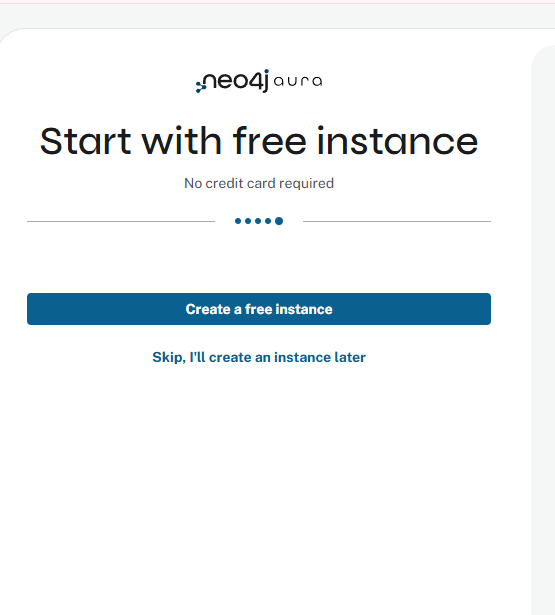
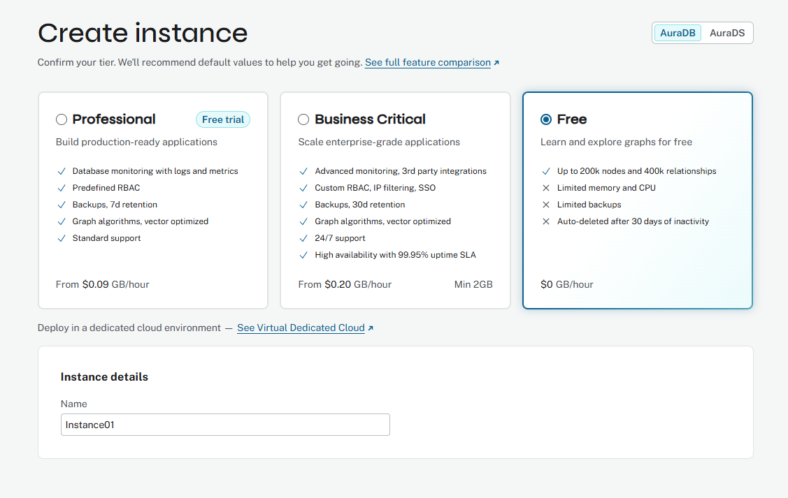

# UCGIS 2026 Workshop

## Advancing Social Media Analytics in Neo4j: Multimodal Embeddings and AI Agents with Knowledge Graphs

**Instructor:** [Dr. Xuebin Wei](https://www.jmu.edu/cise/people/faculty/wei-xuebin.shtml), James Madison University  
**Official workshop description:** [UCGIS 2026 Sched page](https://ucgissymposium2026.sched.com/event/2KN6D/advancing-social-media-analytics-in-neo4j-multimodal-embeddings-and-ai-agents-with-knowledge-graphs)

Welcome! In this hands-on workshop, you will build a social media knowledge graph in Neo4j, explore it with natural-language queries, create text embeddings, run a Python GraphRAG workflow, and configure a free Neo4j Graph Agent.

> **Scope note:** The official title includes multimodal embeddings. During the live workshop, we will focus on **text embeddings** and **text-based GraphRAG** so that participants can complete the full workflow. A text-image embedding tutorial is included as an optional extension.

---

## Before the Workshop

Please bring a laptop with a web browser. No local installation is required because the Python exercises run in Google Colab.

Please also have access to a Gmail account. You may use an existing Gmail account or create a new one for the workshop.

All workshop activities use free tiers. You do not need to purchase anything or provide a credit card.

---

## Workshop Outcomes

By the end of the workshop, you will have:

1. A free Neo4j AuraDB instance.
2. A synthetic Twitter/X-style social media knowledge graph.
3. A graph schema with `User`, `Tweet`, `Place`, and `Hashtag` nodes.
4. Natural-language AI queries translated into Cypher.
5. A 3072-dimensional Gemini text-embedding workflow.
6. A Neo4j vector index for semantic search.
7. Python-based GraphRAG, Cypher-Augmented Generation, and Geo-Augmented GraphRAG examples.
8. A free no-code Neo4j Graph Agent configured with specific instructions.

---

## Account Setup

### Step 0A: Create a Free Neo4j AuraDB Instance

1. Go to [Neo4j Aura](https://neo4j.com/cloud/aura/) and sign up or log in.
2. **Do not create the default trial instance shown immediately after registration.** Although the onboarding screen says "Start with free instance," this is the temporary trial flow. Select **Skip, I'll create an instance later**.

<p align="center">
  
</p>

*Skip the default onboarding instance. We will create the actual AuraDB Free instance manually.*

3. From the AuraDB Instances page, click **Create instance**.
4. Select the **Free** AuraDB tier. Do not select the Professional free trial.

<p align="center">
  
</p>

*Select the actual **Free** AuraDB tier.*

5. Create the instance and download the credentials `.txt` file.
6. Store the file safely. You will need:
   - `NEO4J_URI`
   - `NEO4J_USERNAME`
   - `NEO4J_PASSWORD`

> The AuraDB Free instance is sufficient for this workshop. Do not share your password or commit credentials to GitHub.

<p align="center">
  
</p>

*A successfully created AuraDB Free instance should appear as **RUNNING**.*

### Step 0B: Create a Free Gemini API Key

1. Go to [Google AI Studio](https://aistudio.google.com/).
2. Sign in and create an API key.
3. Save it as `GOOGLE_API_KEY`.

### Step 0C: Add Credentials to Google Colab Secrets

In Google Colab, click the **key icon** in the left sidebar. Add these secrets and enable notebook access:

```text
NEO4J_URI
NEO4J_USERNAME
NEO4J_PASSWORD
GOOGLE_API_KEY
```

The ETL notebook uses the three Neo4j values. The GraphRAG notebook uses all four values.

<p align="center">
  
</p>

> **Note:** The screenshot is only an example of the Colab Secrets interface. For this workshop, create the four secrets exactly as listed above: `NEO4J_URI`, `NEO4J_USERNAME`, `NEO4J_PASSWORD`, and `GOOGLE_API_KEY`.

---

## Workshop Flow

### Part 1: Build the Social Media Knowledge Graph

Open the ETL notebook:

- [GitHub notebook](https://github.com/lbsocial/data-analysis-with-generative-ai/blob/main/Social_Media_ETL_Neo4j_Python.ipynb)
- [Open in Google Colab](https://colab.research.google.com/github/lbsocial/data-analysis-with-generative-ai/blob/main/Social_Media_ETL_Neo4j_Python.ipynb)

This notebook:

1. Installs `neo4j` and `faker`.
2. Generates synthetic Twitter/X-style posts with semantic clusters such as Neo4j, AI, Python, and Cloud.
3. Connects to Neo4j AuraDB.
4. Uses Cypher `UNWIND` to batch-ingest the data.
5. Creates a connected graph.

The graph schema is:

```text
(:User)-[:POSTED]->(:Tweet)
(:Tweet)-[:LOCATED_AT]->(:Place)
(:Tweet)-[:TAGGED_WITH]->(:Hashtag)
```

### Part 2: Explore the Graph and Use AI Query

After the ETL notebook completes:

1. Open your Neo4j AuraDB instance.
2. Open the **Explore** tool.
3. Double-click nodes to expand the network.
4. Use the AI Query feature to translate plain English into Cypher.

Try:

```text
Show me all users in New York.
Find the users who posted tweets containing the hashtag AI.
Which hashtags appear most frequently?
Which users posted the most tweets?
```

You can also try a manual Cypher query:

```cypher
MATCH (u:User)-[:POSTED]->(t:Tweet)-[:TAGGED_WITH]->(h:Hashtag)
RETURN u.username, t.text, h.name
LIMIT 25;
```

<p align="center">
  
</p>

*Neo4j AI Query translates a natural-language request into Cypher and returns matching users.*

<p align="center">
  
</p>

*The Explore view reveals connected `User`, `Tweet`, `Hashtag`, and `Place` nodes.*

### Part 3: Optional Dashboard Demonstration

Neo4j can generate an interactive dashboard from plain-English instructions. A useful prompt is:

```text
I want to explore the locations of tweets, popular hashtags, and date.
```

<p align="center">
  
</p>

*Describe the dashboard in plain English and let Neo4j generate an initial layout.*

<p align="center">
  
</p>

*Example dashboard showing tweet locations, hashtag counts, and activity trends.*

#### Optional Exercise: Add Dashboard Parameters

Adding place and hashtag parameters is optional. If time allows, try this exercise independently.

You can add interactive parameters for places and hashtags. For example:

```cypher
WHERE (p.name = $place_name OR $place_name IS NULL)
```

<p align="center">
  
</p>

*Link a reusable place selector to the `$place_name` parameter.*

<p align="center">
  
</p>

*Use `$place_name` in the map query so the dashboard updates interactively.*

### Part 4: Create Text Embeddings and Build GraphRAG

Open the GraphRAG notebook:

- [GitHub notebook](https://github.com/lbsocial/data-analysis-with-generative-ai/blob/main/GraphRAG_Social_Media_Neo4j.ipynb)
- [Open in Google Colab](https://colab.research.google.com/github/lbsocial/data-analysis-with-generative-ai/blob/main/GraphRAG_Social_Media_Neo4j.ipynb)

The notebook uses Gemini's `gemini-embedding-001` model to generate **3072-dimensional** embeddings for tweet text and stores them in Neo4j.

It creates a vector index similar to:

```cypher
CREATE VECTOR INDEX tweet_embeddings IF NOT EXISTS
FOR (t:Tweet) ON (t.embedding)
OPTIONS {indexConfig: {
  `vector.dimensions`: 3072,
  `vector.similarity_function`: 'cosine'
}}
```

The notebook then walks through:

1. Vector-only semantic search.
2. Graph traversal to enrich retrieved tweets with users, locations, hashtags, metrics, and related posts.
3. Gemini-generated grounded answers.
4. Comparison of traditional RAG and GraphRAG.
5. Interactive GraphRAG questions.

Try:

```text
What are people saying about graph databases?
What are people discussing in New York?
What topics does a specific user post about?
```

### Part 5: Cypher-Augmented Generation

Vector search is useful for semantic questions, but it is not the right tool for counts, rankings, or exact filters. The notebook therefore includes Cypher-Augmented Generation: Gemini translates a question into a Neo4j Cypher query and summarizes the results.

Try:

```text
How many tweets were posted from each city?
Which users have the highest follower counts?
Which hashtags appear most frequently?
```

### Part 6: Geo-Augmented GraphRAG

The notebook also combines:

1. Neo4j `point.distance()` geospatial filtering.
2. Vector search.
3. Graph traversal.
4. Gemini response generation.

Try:

```text
What are people near London saying about AI?
What topics are discussed within 50 km of San Francisco?
```

### Part 7: Build a Free Neo4j Graph Agent

Use Neo4j's no-code AI agent interface:

1. Point the agent to your Neo4j database.
2. Select the embedding provider and `gemini-embedding-001`.
3. Create the agent.
4. Add specific instructions describing the schema and the desired retrieval strategy.
5. Test the agent in the Neo4j website interface.

<p align="center">
  
</p>

*Create an Aura agent using the graph instance, the embedding model, and a schema-aware prompt.*

<p align="center">
  
</p>

*Use a specific prompt that describes the schema and the expected tasks.*

<p align="center">
  
</p>

*The agent may select different tools, such as Text2Cypher and user-specific graph queries.*

<p align="center">
  
</p>

*Example output from a graph-aware social-media analytics agent.*

> Building, testing, and querying the agent within the Neo4j website interface is free. External deployment, such as an API or MCP server, may require a paid tier.

Use this prompt as a starting point:

```text
You are a social media analytics assistant working with a Neo4j knowledge graph.

Graph schema:
(:User)-[:POSTED]->(:Tweet)
(:Tweet)-[:LOCATED_AT]->(:Place)
(:Tweet)-[:TAGGED_WITH]->(:Hashtag)

Important properties:
User: id, username, name, followers, following, tweet_count
Tweet: id, text, created_at, likes, retweets, replies, location, embedding
Place: name, country, location
Hashtag: name

Use semantic vector search for concepts, themes, meaning, or similar posts.
Use Cypher for counts, rankings, filters, users, locations, hashtags, and relationship-based analysis.
Use geospatial filtering for location-specific questions.
Use multiple tools when a question requires semantic retrieval plus graph context.

Ground every answer in retrieved graph data.
Explain the evidence briefly.
Do not invent tweets, users, places, hashtags, or metrics that are not present in the graph.
```

Test the agent with:

```text
What are people generally saying about graph databases?
What topics are trending among users located in San Francisco?
Find the most popular tweets related to AI and summarize the evidence.
Which users are most active, and what topics do they discuss?
```

---

## Further Reading

1. [Social Media Knowledge Graph: Python & Neo4j](https://www.lbsocial.net/post/social-media-knowledge-graph-python-neo4j)
2. [Neo4j Tutorial: Cypher, Generative AI & Dashboard](https://www.lbsocial.net/post/neo4j-tutorial-cypher-generative-ai-dashboard)
3. [Geo-GraphRAG Tutorial: Neo4j & Gemini](https://www.lbsocial.net/post/geo-graphrag-tutorial-neo4j-gemini)
4. [Neo4j Agent: Free No-Code GraphRAG](https://www.lbsocial.net/post/neo4j-agent-free-no-code-graphrag)
5. [Optional extension: Build a Multimodal Search Engine with Python](https://www.lbsocial.net/post/build-multimodal-search-engine-python)

---

## Image Upload Checklist

Upload the following files into `UCGIS2026/images/`:

```text
01-start-free-instance.png
02-select-auradb-free-tier.png
03-auradb-free-running.jpg
04-colab-secrets.jpg
05-ai-query-cypher.jpg
06-explore-hashtag-ai-graph.jpg
07-dashboard-create-with-ai.jpg
08-dashboard-overview.jpg
09-dashboard-place-parameter.jpg
10-dashboard-place-cypher.jpg
11-agent-create-with-ai.jpg
12-agent-prompt-example.jpg
13-agent-tool-reasoning.jpg
14-agent-result.jpg
```

---

## Troubleshooting Checklist

- Skip the default onboarding trial instance after registration.
- Confirm that you manually created an **AuraDB Free** instance rather than the Professional free trial.
- Download and save the AuraDB credentials file.
- Use the exact Colab Secret names listed above.
- Enable notebook access for each secret.
- Run the ETL notebook before the GraphRAG notebook.
- Never share or commit API keys and passwords.
